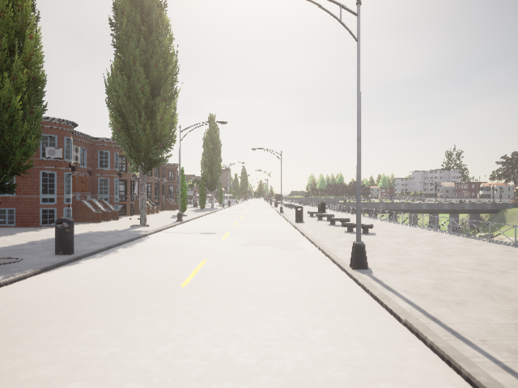

# StereoGeo Dataset

**StereoGeo: an end-to-end stereo camera calibration method**

[](https://arxiv.org/abs/2606.14619)

[](https://huggingface.co/datasets/meddourimane/StereoGeo-CARLA)

---

## Introduction

**StereoGeo** is a comprehensive stereo camera calibration dataset designed for deep learning-based calibration methods. It addresses the challenge of jointly estimating intrinsic and extrinsic camera parameters without calibration patterns.

The complete training dataset consists of **55,913 stereo pairs** from three complementary sources:

### Dataset Composition

| Dataset | Pairs | Source | Type | Details |
|---------|-------|--------|------|---------|
| **SUNCG** | 38,324 | SUNCG + 3D60 panoramas | Indoor scenes | 16 crops/panorama, fixed baseline 0.26 m |
| **CARLA** | 12,220 | CARLA Simulator | Urban driving | Multi-city & weather, baseline 0.20–0.70 m |
| **TartanAir** | 5,000 | TartanAir dataset | 12 simulated env. | Geometric diversity |
| **TOTAL** | **55,913** | Mixed | — | 90% train / 5% val / 5% test |
---

## CARLA Public Dataset

We publicly release the **CARLA stereo subset** (12,220 pairs, 12.2 GB) with ground-truth calibration parameters:

<div align="center">

**[Download from HuggingFace](https://huggingface.co/datasets/meddourimane/StereoGeo-CARLA)**

</div>

### CARLA Statistics

- 12,220 stereo image pairs
- Resolution: 640×640 pixels
- Baseline range: 0.20 - 0.70 m
- Roll/Pitch: ±0.5°
- Vertical FoV: 55° - 75°
- Total size: ~12.2 GB

### Example Stereo Pairs

<table>
<tr>
<td><b>Left Camera</b></td>
<td><b>Right Camera</b></td>
</tr>
<tr>
<td></td>
<td></td>
</tr>
</table>

---


### Key Contributions
- First learning-based method for joint stereo intrinsic & extrinsic calibration
- No calibration patterns required
- Independent per-camera intrinsic estimation
- State-of-the-art performance on KITTI

---

## License

This dataset is licensed under **Creative Commons Attribution 4.0 International (CC-BY-4.0)**


## Acknowledgments


- CGP has benefited from French State aid managed by the Agence Nationale de la Recherche (ANR) under France 2030 program with the reference ANR-23-PEIA-005 (REDEEM project)
- CARLA Simulator Team
- 3D60 Dataset Authors
- TartanAir Dataset Authors


---

## Citation

If you use the StereoGeo dataset, please cite:

```bibtex
@misc{meddour2026stereogeoendtoendstereocamera,
      title={StereoGeo: an end-to-end stereo camera calibration method}, 
      author={Imane Meddour and Andréa Macario Barros and Cédric Gouy-Pailler},
      year={2026},
      eprint={2606.14619},
      archivePrefix={arXiv},
      primaryClass={cs.CV},
      url={https://arxiv.org/abs/2606.14619}, 
}
```

