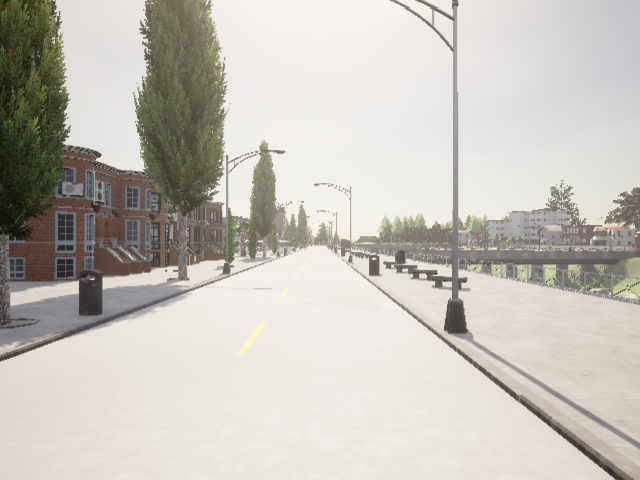

cat > README.md << 'EOF'
# 🎥 StereoGeo Dataset

**StereoGeo: an end-to-end stereo camera calibration method**

[](https://arxiv.org/abs/XXXX.XXXXX)
[]
[](https://huggingface.co/datasets/meddourimane/StereoGeo-dataset)

---

## 📖 Introduction

**StereoGeo** is a comprehensive stereo camera calibration dataset designed for deep learning-based calibration methods. It addresses the challenge of jointly estimating intrinsic and extrinsic camera parameters without calibration patterns.

The complete training dataset consists of **55,913 stereo pairs** from three complementary sources:

### 🏢 Dataset Composition

| Dataset | Pairs | Source | Characteristics |
|---------|-------|--------|-----------------|
| **SUNCG** | 38,324 | Indoor Panoramas | Diverse scenes via 3D60 |
| **CARLA** | 12,220 | Driving Simulator | Urban scenarios, weather variation |
| **TartanAir** | 5,000 | Synthetic Environments | Varied geometric structures |
| **TOTAL** | **55,913** | Mixed | 90% train / 5% val / 5% test |

---

## 🚗 CARLA Public Dataset

We publicly release the **CARLA stereo subset** (12,220 pairs, 12.2 GB) with ground-truth calibration parameters:

<div align="center">

**[📥 Download from HuggingFace](https://huggingface.co/datasets/meddourimane/StereoGeo-dataset)**

</div>

### Dataset Statistics

**CARLA Subset:**
- 12,220 stereo image pairs
- Resolution: 640×640 pixels
- Baseline range: 0.20 - 0.70 m
- Roll/Pitch: ±45°
- Vertical FoV: 55° - 75°
- Total size: ~12.2 GB

### 🖼️ Example Stereo Pairs

<table>
<tr>
<td><b>Left Camera</b></td>
<td><b>Right Camera</b></td>
</tr>
<tr>
<td></td>
<td></td>
</tr>
</table>


## 📊 Dataset Details

### SUNCG Subset (38,324 pairs)
- **Source:** SUNCG + 3D60 panoramas
- **Type:** Indoor scenes
- **Generation:** 16 crops per panorama with variable orientation
- **Baseline:** Fixed 0.26 m

### CARLA Subset (12,220 pairs) ✅ **PUBLIC**
- **Source:** CARLA Simulator
- **Type:** Urban driving scenarios
- **Generation:** Multiple towns & weather conditions
- **Baseline:** Variable (0.20 - 0.70 m)
- **Download:** [HuggingFace](https://huggingface.co/datasets/meddourimane/StereoGeo-dataset)

### TartanAir Subset (5,000 pairs)
- **Source:** TartanAir dataset
- **Type:** 12 diverse simulated environments
- **Purpose:** Geometric diversity

---

## 📁 Data Access

### Public Dataset (CARLA)
- **HuggingFace:** https://huggingface.co/datasets/meddourimane/StereoGeo-dataset
- **Format:** PNG images + CSV metadata
- **License:** CC-BY-4.0


---

## 📄 Citation

If you use the StereoGeo dataset, please cite:

```bibtex
@inproceedings{anfel2026stereogeo,
  title={StereoGeo: End-to-End Stereo Camera Calibration Method},
  author={imane, Andréa, Cédric},
  booktitle={EUSIPCO},
  year={2026}
}
```

---

## 📖 Paper

**StereoGeo: End-to-End Stereo Camera Calibration via Learning and Optimization**

📌 Published at: EUSIPCO 2026

👉 [Read the paper](https://example.com)

### Key Contributions
- First learning-based method for joint stereo intrinsic + extrinsic calibration
- No calibration patterns required
- Independent per-camera intrinsic estimation
- State-of-the-art performance on KITTI

---

## 📜 License

This dataset is licensed under **Creative Commons Attribution 4.0 International (CC-BY-4.0)**


## 🙏 Acknowledgments

- CARLA Simulator Team
- 3D60 Dataset Authors
- TartanAir Dataset Authors
- CEA-List
- Université Paris-Sacaly
- EUSIPCO 2026 Conference

---

**Last Updated:** May 2026
EOF
